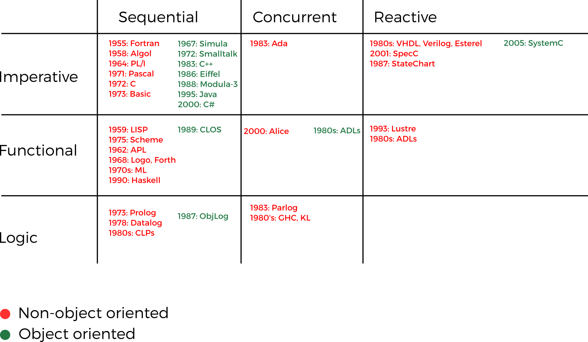

# Concepts of Programming Languages

## Reasons for Studying Concepts of Programming Languages

* **Increased capacity to express ideas.** People only a weak understanding of
  natural language are limited in the complexity of their thoughts, particularly
  in depth of abstraction. In other words, it is difficult for people to
  conceptualize structures they cannot describe, verbally or in writing. In the
  software world, programmers are similarly constrained by the languages they
  know. Awareness of a wider variety of programming language features can reduce
  such limitations in software development.

* **Improved background for choosing appropriate languages.** Familiarity with a
  wider variety of languages and language constructs means programmers are
  better able to choose the language with the best features that best address a
  specific problem.

* **Increased ability to learn new languages.** Computer programming is a
  relatively young discipline, and thus it's still in a state of continuous
  evolution. While software development is an exciting profession, it also
  demands continuous learning of new technologies. Once a thorough understanding
  of the fundamental concepts of languages is acquired, it becomes far easier to
  see how these concepts are incorporated into the design of the language being
  learned.

* **Better understanding of the significance of implementation.** In learning
  the concepts of programming languages, it is both interesting and necessary to
  touch on the implementation issues that affect those concepts which leads 
  to an understanding of why languages are designed the way they are. In turn,
  this knowledge leads to the ability to use a language more intelligently, as
  it was designed to be used. We can become better programmers by understanding
  the choices among programming language constructs and the consequences of
  those choices.

* **Better use of languages that are already known.** Most contemporary
  programming languages are large and complex. Accordingly, it is uncommon for a
  programmer to be familiar with and use all of the features of a language he or
  she uses. By studying the concepts of programming languages, programmers can
  learn about previously unknown and unused parts of the languages they already
  use and begin to use those features.

* **Overall advancement of computing.** In general, if those who choose
  languages were well informed, perhaps better languages would eventually
  squeeze out poorer ones. For example, many people argue that it'd have been
  better if ALGOL 60 had displaced FORTRAN in the early 1960s, because it was
  more elegant and had much better control statements, among other reasons. That
  it did not, is due partly to the programmers and software development managers
  of that time, many of whom did not clearly understand the conceptual design of
  ALGOL 60.

## Programming Domains

* **Scientific applications** 
    * The first digital computers, which appeared in the late 1940s and early
      1950s, were invented and used for scientific applications.
    * Large numbers of floating-point arithmetic computations.
    * Data structures (e.g., arrays and matrices) and control structures (e.g.,
      counting loops and selections).
    * Fortran was the first language for scientific application; for some
      scientific applications where efficiency was the primary concern, no
      language is significantly better than Fortran.

* **Business applications**
    * The use of computers for business applications began in the 1950s. Special
      computers were developed for this purpose, along with special languages.
    * Production of elaborate reports, precise ways of describing and storing
      decimal numbers and character data, and the ability to specify arithmetic
      operations.
    * COBOL was the first successful HLL for business.

* **Artificial Intelligence**
    * Artificial intelligence (traditional AI) is a broad area of computer
      applications characterized by the use of symbolic rather than numeric
      computations (i.e., symbols, consisting of names rather than numbers, are
      manipulated).
    * Less computationaly intensive, but required more flexibility than other
      programming domains.
    * Data structures (e.g., symbols, linked lists)
    * Lisp was the widely used programming language developed for AI
      applications, which appeared in 1959.

* **Web applications**
    * Pervarsive need for dynamic Web content, portability and security are also
    important.
    * JAVA was among the first programming languages used in the Web. Nowadays
    languages such as JavaScript and PHP are more common part of the Web.

## Criteria for Evaluating Languages

### Readability

Readability concerns itself with how easy is it to read/understand a program
in a given language.

* **Simplicity.** A language with a large number of basic
  constructs is more difficult to learn than one with a smaller number.
  Programmers who must use a large language often learn a subset of the
  language and ignore its other features. Readability can be reduced ina few
  ways:
    * **language subset**, in which the program’s author has learned a different
    subset from that subset with which the reader is familiar. Example: C++,
    Perl, etc.
    * **feature multiplicity** by which there's more than one way to to accomplish
    a task. Example: Variable increment as in `count = count + 1`, `count += 1`,
    `count++`, and `++count`.
    * **operator overloading**, in which a single operator symbol has more than
    one meaning. Example: In C++, users can overload built-in operators with
    their semantics. Some languages such as Raku mistigate this by encouraging
    users to create their own operators instead of overloading the built-in
    ones.
    
* **Orthogonality.** This means that a relatively small set of primitive
  constructs can be combined in a relatively small number of ways to build
  the control and data structures of the language. Orthogonality
  follows from a symmetry of relationships among primitives and a lack of
  orthogonality leads to exceptions to the rules of the language. In
  general, orthogonality means every combination of constructs can be used
  in every context.

    * Example: Lack of orthogonality in C means `structs` can be returned from
    functions but arrays cannot, from functions but arrays cannot, a member of a
    structure can be any data type except void or a structure of the same type,
    an array element can be any data type except `void` or a function,
    parameters are passed by value unless they're arrays in which they're passed
    by reference, etc.

* **Data types.** The presence of adequate facilities for defining data types
  and data structures in a language is another significant aid to readability.

    * Example: A `Boolean` type for setting up flags, instead of using integers.
    Thus, `Bool verbose = True` (meaning is perfectly clear) instead of `verbose
    = 1` (meaning isn't clear).
    * Many languages allow the programmers to extend the language from its
    built-in constructs. In Raku, `subset` is a way to construct a subset using
    the built-in types (e.g., `subset PosInt of Int where * >= 1` where `PosInt`
    is a derived type of `Int` for only positive integers).

* **Syntax design.** The syntax, or form, of the elements of a language has a
  significant effect on the readability of programs.

    * **Special words.** Special words. Program appearance and thus program
      readability are strongly influenced by the forms of a language’s special
      words (for example, `while`, `unless`, `class`, `for`, etc.). If special
      words of a language can be used as names for program variables, then
      readibility is reduced (e.g., in Fortran 95, special words such as `Do`
      and `End` are legal variable names).
    * **Form and meaning.** Designing statements so that their
      appearance at least partially indicates their purpose is an obvious aid to
      readability. Semantics, or meaning, should follow directly from syntax, or
      form. This principle is violated by two language constructs that are
      identical or similar in appearance but have different meanings, depending
      perhaps on context. For example, in C the meaning of the reserved word
      `static` depends on the context on which it appears.

### Writability

Writability is a measure of how easily a language can be used to create programs
for a chosen problem domain. Most of the language characteristics that affect
readability also affect writability.

* **Simplicity and orthogonality.** If a language has a large number of
  different constructs, some programmers who use the language might not be
  familiar with all of them. Similarly, too much orthogonality can a detriment
  to writability since errors in programs can go undetected when nearly any
  combination of primitives is legal.

* **Expressivity.** Expressivity in a language can refer to several different
  characteristics. More commonly, it means that a language has relatively
  convenient, rather than cumbersome, ways of specifying computations. For
  example, in C `count++` is more convenient and shorter than `count = count +
  1`, the `and...then` Boolean operator in Ada is a convenient way of specifying
  short-evaluation of a Boolean expression, use of Boolean expressions without
  explicit comparison/conversion in control statements such as `if` (e.g., `if
  verbose {...}` instead of `if verbose == true {...}`), `for` loops that
  iterate over iterable constructor instead of using a `while` loop which
  indexing (e.g., `for students { ... }` instead of `while (idx < students.size)
  {...}`), etc.

* **Support for abstraction.** Can you concentrate on a single level abstraction
  (ignoring details while programming? For example, there's no need to drop to
  Assembly when writing most modern applications, most HLLs provide nice levels
  of abstraction that allows the programmer to concentrate on the problem at
  hand.

### Reliability

A program is said to be reliable if it performs to its specifications under all
conditions. 

* **Type checking.** Simply testing for type errors in a given program, either
  by the compiler or during program execution. Because run-time type checking is
  expensive, compile-time type checking is more desirable. Furthermore, the
  earlier errors in programs are detected, the less expensive it is to make the
  required repairs. 

* **Exception handling support.** The ability of a program to intercept run-time
  errors, take corrective measures, and then continue is an obvious aid to
  reliability. Ada, C++, Java, and C# include extensive capabilities for
  exception handling, but such facilities are practically nonexistent in some
  widely used languages, for example, C.

* **Aliasing.** Loosely defined, **aliasing** is having two or more distinct names
  in a program that can be used to access the same memory cell. Nowadays
  aliasing [considered harmful](https://en.wikipedia.org/wiki/Considered_harmful).
  Still most programming languages allow some kind of aliasing—for example, two
  pointers (or references) set to point to the same variable, which is possible
  in most languages. In some languages, aliasing is used to overcome
  deficiencies in the language’s data abstraction facilities. Other languages
  greatly restrict aliasing to increase their reliability.
  
## Trade-offs

* **Reliability vs cost.** Java requires bound checking on all array access
  which makes them more reliable but results in greater execution cost. In C the
  opposite is the case: lower execution cost but less reliability.

* **Readability vs writability.** APL has numerous (and powerful) operators
  which leads to small programs but unreadable programs to programmer not
  acquainted with the language. Also the large number of operators usually
  require a [custom keyboard](http://www.microapl.com/apl_help/ch_000_030.htm)
  for the language.

* **Writability vs reliability.** Pointers in C and C++ give flexibility for
  many low-level operations, but are unreliable and hard to verify.

## Lifecycle Cost Factors

* **Cost of training programmers to use the language**, which is a function of the
  simplicity and orthogonality of the language, and the programmer's experience.

* **Cost of writing programs in the language**, which is a function of the
  writability of the language, which in parts depends on its closeness in
  purpose to the particular application.

* **Cost of executing programs written in a language** is greatly influenced by
  that language's design. A language that requires many run-time type checks
  will prohibit fast code execution, regardless of the quality of the compiler.

* **Cost of maintenance of programs in the language** which is both depended on
  the readability and writability of the language. While most programs are only
  written once, they need to be mantained by long periods of time usually by
  different programmers.

## Programming Paradigms (The Traditional Way)

* **Imperative/procedural.** Statements are executed for their side-effects on
  environment/variables. Usually control-based.

* **Functional/applicative.** Statements are executed for their input-output
  functionality, and not their side-effects. Based on composition of functions
  ([lambda calculus](https://en.wikipedia.org/wiki/Lambda_calculus)).

* **Logic.** Programmer states **what** the problem is, and not **how** to solve
  it; thus, no statements. Based on relations and first-order logic (FOL).

* **Object-oriented.** Programs are structured around abstract data types, with
  encapsulation, inheritance, etc.

* **Concurrent.** Intended to model parallel tasks, maybe for execution on a
  parallel target architecture.

## Programming Paradigms (Another Way)

Object-oriented, concurrent, etc. are not paradigms independent of the others.
Thus:

```text
{Imperative, Functional, Logic} X
{Non-object-oriented, Object-oriented} X
{Sequential, Concurrent, Reactive} = {
    Imperative Non-object-oriented Sequential,
    Imperative Non-object-oriented Concurrent,
    ...,
    Logic Object-oriented Concurrent,
    Logic Object-oriented Reactive,
}
```

## A Few Programming Languages



