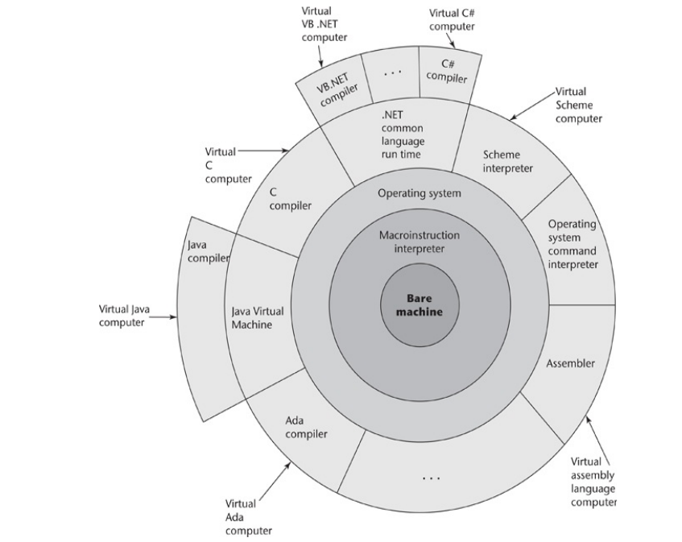

# Implementation Methods

Two of the primary components of a computer are its internal memory and its processor:

* The **internal memory** is used to store programs and data. 
* The **processor** is a collection of circuits that provides a realization of a
  set of primitive operations, or machine instructions, such as those for
  arithmetic and logic operations.

The machine language of the computer is its set of instructions, and in the absence
of other supporting software, its own machine language is the only language that
most hardware computers “understand.” Theoretically, a computer could be
designed and built with a particular high-level language as its machine
language, however

* it would be very complex and expensive,
* it would be highly inflexible, because it would be difficult (but not
  impossible) to use it with other high-level languages.

The more practical machine design choice implements in hardware a very low-level
language (e.g., machine code) that provides the most commonly needed primitive
operations and requires system software to create an interface to programs in
higher-level languages.

## Layered View of a Computer System



* On top of the **bare machine**, instructions that handle basic operations such
  arithmetic and logic operations are known as **macro-instructions**, which 
  are actually implemented with a set of instructions called
  **microinstructions**, which are defined at an even lower level.
  Microinstructions are never seen by software.
* The **operating system** is a large collection of programs, which supplies
  higher-level primitives than those of the machine language. These primitives
  provide system resource management, I/O operations, a file management system,
  text and/or program editors, etc.
* **Language implementation systems** need many of the operating system facilities,
  so they interface with the operating system rather than directly with the
  processor (in machine language). These layers can be considered as **virtual
  computers** that provide interfaces to the user at higher levels. For example,
  an operating system and a C compiler provide a virtual C compiler.
* **User programs** form another layer over the top of the layer of virtual
  computers.

## von Neumann Bottleneck

The speed of the connection between a computer’s memory and its processor often
determines the speed of the computer, because instructions often can be executed
faster than they can be moved to the processor for execution. This connection is
called the **von Neumann bottleneck**; it is the primary limiting factor in the
speed of von Neumann architecture computers. 

The von Neumann bottleneck has been one of the primary motivations for the
research and development of **parallel computers**.

## Compilation

**Compilation** is one of the implementation methods for programming languages.
By this method, programs are translated into machine code which can be
executed directly on the computer. Note that usually an assembler is involved,
however this is always called directly by the compiler, and for most intent and
purposes, we assume the compiler translates a high-level language (HLL) directly
to machine code.

The language that a compiler translates is called the **source language**. The
process of compilation and program execution takes place in several phases:

1. **Source program:** The compilation process starts with the HLL's source
   program.

2. **Lexical analyzer:** The lexical analyzer gathers the characters of the
   source program into lexical units. The lexical units of a program are
   identifiers, special words, operators, and punctuation symbols while ignoring
   comments for which the compiler has no use.

3. **Syntax analyzer:**  The syntax analyzer takes the lexical units from the
   lexical analyzer and uses them to construct hierarchical structures called
   **parse trees**, which represent the syntactic structure of the program. 

4. **Intermediate code generator (ICG):** The ICG produces a program in a
   different language, at an intermediate level between the source program
   and the final output of the compiler: the machine language program.
   Intermediate languages sometimes look very much like assembly
   languages, and other cases the intermediate code is at a level somewhat
   higher than an assembly language. 

   The **semantic analyzer** is an integral part  of the intermediate code
   generator. The semantic analyzer checks for errors, such as type errors, that
   are difficult, if not impossible, to detect during syntax analysis.

   At this stage **optimization** can take place. Optimization improves
   programs (usually in their intermediate code version) by making them smaller,
   faster, or both. Because many kinds of optimization are difficult to do on
   machine language, most optimization is done on the intermediate code.

   The **symbol table** serves as a database for the compilation process. The
   primary contents of the symbol table are the type and attribute information
   of each user-defined name in the program. This information is placed in the
   symbol table by the lexical and syntax analyzers and is used by the semantic
   analyzer (in the ICG) and the code generator (next stage).

5. **Code generator:** The code generator translates the optimized intermediate
   code version of the program into an equivalent machine language program.

6. **Computer:** The machine language generated by a compiler can be executed
   directly on the hardware, however it must always be run along with some other
   code. Most user programs also require programs from the operating system.
   
    1. **linking:** Before the machine language programs produced by a compiler
      can be executed, the required programs from the operating system must be
      found and linked to the user program. The linking operation connects the
      user program to the system programs by placing the addresses of the entry
      points of the system programs in the calls to them in the user program. 
      All this is accomplished by a systems program called the **linker**.

    2. **load module:** Also known as **executable image**, this is simply the
      user and system code together after the linking process is done.
      The executable image is loaded into the computer by a systems program
      known as the **loader**.


## Pure Interpretation

Unlike compilation, the method of **pure interpretation** has no translation
whatsoever. Instead programs are interpreted by another program known as the
**interpreter**, which acts as a software simulation of a machine whose
fetch-execute deals with HLL programs rather than machine code instructions.
This software simulation obviously provides a virtual machine for the language.

**Advantages:**

* Easy implementation of many source-level debugging operations because all
  run-time error message can refer to sourec-level units.

**Disadvantages:**

* Implementation of source-level debugging operations is slow, with the
  execution being 10 to 100 times slower that in compiled systems. The primary
  source of this slowness is the decoding of the high- level language
  statements, which are far more complex than machine language instructions

  Furthermore, regardless of how many times a statement is executed, it must
  be decoded every time. Therefore, **statement decoding, rather than the
  connection between the processor and memory, is the bottleneck of a pure
  interpreter**.

* More space is required. In addition to the source program, the symbol table
  must be present during interpretation.

  Furthermore, the source program may be  stored in a form designed for easy
  access and modification rather than one that provides for minimal size.


## Hybrid Implementation

**Hybrid implemenatation systems** are a compromise between compilers and pure
interpreters; they translate high-level language programs to an intermediate
language designed to allow easy interpretation. This method is faster than pure
interpretation because the source language statements are decoded only once.
Instead of translating intermediate language code to machine code, it simply
interprets the intermediate code.


**Examples:**

* Perl is implemented with a hybrid system. Perl programs are partially
  compiled to detect errors before interpretation and to simplify the
  interpreter.

* Initial implementations of Java were hybrid. Its intermediate form, called
  **bytecode**, provides portability to any machine that has a byte code
  interpreter and an associated run-time system. Together, these are called the
  **Java Virtual Machine (JVM)**.

* A **Just-in-Time (JIT)** implementation system initially translates programs
  to an intermediate language. Then, during execution, it compiles intermediate
  language methods into machine code when they are called. The machine code
  version is kept for subsequent calls. JIT systems now are widely used for Java
  programs. 

## Preprocessors

A preprocessor is a program that processes a program just before the program is
compiled. Preprocessor instructions are embedded in programs. The preprocessor
is essentially a macro expander. Preprocessor instructions are commonly used to
specify that the code from another file is to be included. For example, the C
preprocessor instruction

```c
#include "myLib.h"
```

causes the preprocessor to copy the contents of `myLib.h` into the program at
the position of the `#include`. This is akin to a search-and-replace operation
in a text editor.

Other preprocessor instructions are used to define symbols to represent
expressions. For example, one could use

```c
#define max(A, B) ((A) > (B) ? (A) : (B)) 
```

to determine the largest of two given expressions. Thus, the expression 
`x = max(2 * y, z / 1.73);` would be expanded by the preprocessor to 

```c
x = ((2 * y) > (z / 1.73) ? (2 * y) : (z / 1.73);
```

