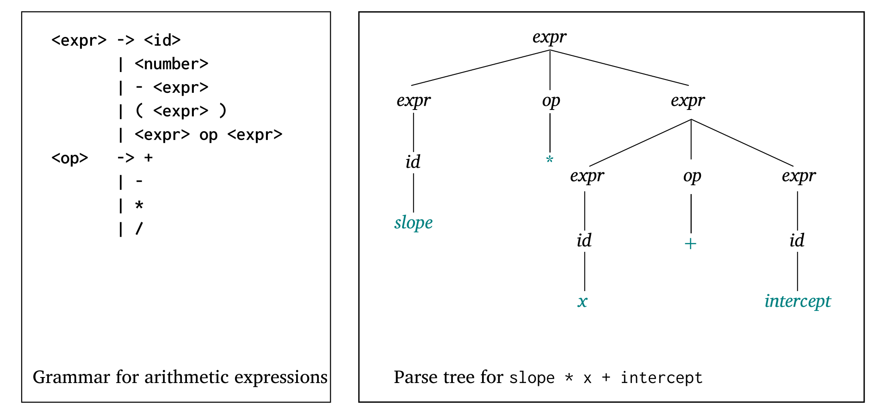
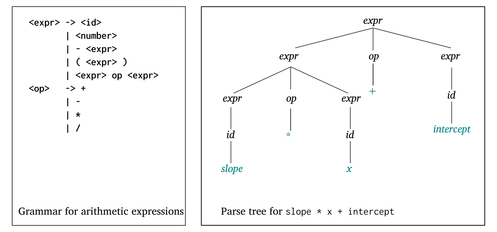
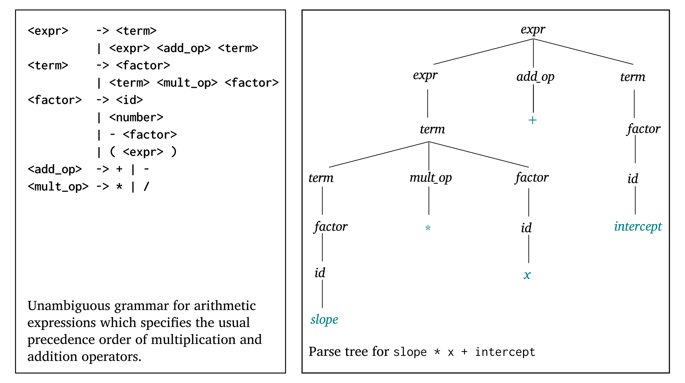
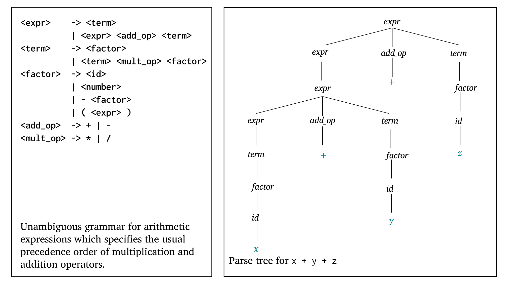

# Syntax and Grammars

The task of providing a concise yet understandable description of a programming
language is difficult but essential to a language’s success:

* On one hand, concise formal descriptions that aren't easily understandable due
  to partly new notation cause languages to lack implementations.

* On the other hand, some languages have suffered the problem of having many
  slightly different dialects, a result of a simple but informal and imprecise
  definition.

## Syntax vs Semantic

* **Syntax** is the **form** of a programming language's expressions,
  statements, and program units.
  * Typically described using **grammars**.
  * It's easier to describe than semantic, partly because a concise and
    universally accepted notation is available for syntax description.

* **Semantic** is the **meaning** of those expressions, statements, and program
  units.
  * Typically described informally (e.g., English).
  * No universal notation has been developed for semantic so it's harder to
  describe than syntax.

Syntax and semantics are closely related. In a well-designed programming
language, semantics should follow directly from syntax; that is, the appearance
of a statement should strongly suggest what the statement is meant to
accomplish.

### Syntax Terminology

* **Sentence.** A sentence is a string of characters over some given alphabet.
  For example, `int foo = 5;` is a sentence over the alphabet that constitutes
  the C language.

* **Language.** A language is a set of sentences. For example, the set of all
  legal C programs.

* **Token.** A token is category of primitve units such as numeric literals,
  operators, keywords, etc.

* **Lexeme.** A lexeme is a small unit described by a token. For example, the
  lexeme 5 is described by the token numeric literal, the lexeme `for` is
  described by the token keyword, etc.

For example, given the following C statement:

```c
index = 2 * count + 17;
```

we've the following lexemes-tokens breakdown:

|Lexemes|Tokens|
|:------|:-----|
|`index`|identifier|
|`=`|equal_sign|
|`2`|int_literal|
|`*`|mult_op|
|`count`|identifier|
|`+`|plus_op|
|`17`|int_literal|
\`;`|semicolon|

## Why Care About Formal Syntax?

In general, languages can be formally defined in two distinct ways:

* **Recognition:** Given an arbitrary sentence, determine whether it's legal in
  some given language. For example, a compiler's syntax analyzer is a
  **recognition device** that determines if a given sentence (e.g., whole
  programs) is a legal sentence in whatever language the compiler translates to.
  Such devices are like filters, separating legal sentences from those that are
  incorrectly formed.

  Recognition devices can only be used in trial-and-error mode. For example, to
  determine the correct syntax of a particular statement using a compiler, the
  programmer can only submit a speculated version and note whether the compiler
  accepts it. Thus they're not as useful a language description for a
  programmer.

* **Generation:** Given the formal sentence of a language, legal sentences are
  generated. Devices that generate the sentences of a language are known as
  **generation devices**.
    
  Unlike recognizers, generators are oftentimes useful to programmers because
  it's often possible to determine whether the syntax of a particular statement
  is correct by comparing it with the structure of the generator.

There is a close connection between formal generation and recognition devices
for the same language. This was one of the seminal discoveries in computer
science, and it led to much of what is now known about formal languages and
compiler design theory.

## Chomsky's Hierarchy of Languages

|Type|Grammar|Machine|Applications|
|:---|:------|:------|:-----------|
|3|regular|DFA, NFA, ...|pattern matching, lexical structure|
|2|context-free|PDA|PLs (typically)|
|1|context-sensitive|bounded TM (Turing Machine)|Natural languages (exc. poetry)|
|0|recursive enumerable|TM||

Remember that pushdown automatas (PDAs) have only one stack.

## Context-Free Grammars

Typically represented using Backus-Naur Form (BNF) which is equivalent to CFG.

Formally, a CFG $<\Sigma, V, P>$ where

* $\Sigma$ is a set of **terminal symbols** (e.g., lexemes and tokens),
* $V$ is a set of **nonterminal symbols** (aka variables), containing a start
  symbol $S$,
* $P$ is a finite non-empty set of **rules** (or **productions**), each of the
  form:
  
  * $A \rightarrow \alpha$, where $A$ is a single nonterminal symbol, and
    $\alpha$ is a finite sequence of terminals and/or nonterminals,
  * $A$ belongs to $V$,
  * each nonterminal has at least one production, and
  * at least one production has $S$ on its left-hand side (LHS).

### BNF Notation and Abbreviations

BNF uses abstractions for syntactic structures. For example, a simple Java
assignment might represented by the following abstraction:

\begin{grammar}
<assign> $\rightarrow$ <var> = <expression>
\end{grammar}

| Abstraction | Meaning |
|:------------|:--------|
| `<assign>` | This is the abstraction being defined; this is usually known as the **left-hand side** (LHS). |
| `<var> = <expression>` | This is the definition of the LHS; it's usually known as the **right-hand side** (RHS).|
|$\rightarrow$|The arrow means "can have the form"; for brevity it's sometimes pronounced "goes to".|
|`<assign>` $\rightarrow$ `<var> = <expression>`| This whole definition is called a **rule** (or **production**). |

One example sentence whose syntactic structure is described by the rule is

```java
total = subtotal1 + subtotal2 
```

In a BNF description, or grammar:

* The abstractions are often called **nonterminal symbols**, and
* the lexemes and tokens of the rules are called **terminal symbols** (or simply
  **terminals**).

Overall, a BNF description, or **grammar**, is a collection of rules.

Nonterminal symbols can have two or more distinct definitions, representing two
or more possible syntactic forms in the language. For example, a Java `if`
statement can be described with the rules:

\begin{grammar}
<if_stmt> $\rightarrow$ if ( <logic_expr> ) <stmt>

<if_stmt> $\rightarrow$ if ( <logic_expr> ) <stmt> else <stmt>
\end{grammar}

Multiple definitions can be written as a single rule, with the different
definitions separated by the symbol `|`, meaning logical OR. Thus, the above
description is the same as

### Examples

#### A Simple Arithmetic Expression

The following CFG describes the structure of an arithmetic expression:

\begin{grammar}
<expr> $\rightarrow$ <id> 
\alt <number> 
\alt - <expr> 
\alt ( <expr> )
\alt <expr> op <expr> 

<op>   $\rightarrow$ +
\alt -
\alt * 
\alt /
\end{grammar}

Regular expressions work well for defining tokens, however they are unable to
specify nested constructs, which are central to programming languages. On the
contrary, the ability of CFGs to define a construct in terms of itself is
crucial. A rule is **recursive** if its LHS appears in its RHS; thus `<expr>` is
a recursive rule.

#### Describing Lists

Variable-length lists in mathematics are often written using an ellipsis
($\ldots$); $1, 2, \ldots$ is such an example. They can be defined recursively
and thus a CFG can describe them in the following manner:

\begin{grammar}
<id_list> $\rightarrow$ id
\alt id, <id_list> 
\end{grammar}

This defines `<id_list>` as either a single token (`id`) or an identifier
followed by a comma and another instance `<id_list>`. 

### Derivations

A context-free grammar (CFG) shows us how to generate a syntactically valid
string of terminals:
> Begin with the start symbol. Choose a production with the start symbol on the
> left-hand side; replace the start symbol with the right-hand side of that
> production. Now choose a nonterminal A in the resulting string, choose a pro-
> duction P with A on its left-hand side, and replace A with the right-hand side
> of P. Repeat this process until no nonterminals remain.

As an example, we can use the grammar for arithmetic expression to generate the
string $slope * x + intercept$:

\begin{grammar}
<expr> $\Rightarrow$ <expr> <op> <expr> \\
	   $\Rightarrow$ <id> <op> <expr> \\
	   $\Rightarrow$ slope <op> <expr> \\
	   $\Rightarrow$ slope * <expr> \\
	   $\Rightarrow$ slope * <expr> + <expr> \\
	   $\Rightarrow$ slope * <id> + <expr> \\
	   $\Rightarrow$ slope * x + <expr> \\
	   $\Rightarrow$ slope * x + <id> \\
	   $\Rightarrow$ slope * x + intercept \\
\end{grammar}

The $\Rightarrow$ metasymbol is often pronounced “derives.” It indicates that the
right-hand side was obtained by using a production to replace some nonterminal
in the left-hand side. 

* A **derivation** is a series of replacement operations that shows how to
  derive a string of terminals from the start symbol. 
* Each string of symbols along the way is called a **sentential form**. 
* The **final sentential form**, consisting of only terminals, is called the
  **yield** of the derivation. 
* We sometimes elide the intermediate steps and write $expr \Rightarrow^{*} slope * x +
  intercept$, where the metasymbol $\Rightarrow^{*}$ means “derives after zero or more
  replacements.” 

Different replacement strategies leads to different derivations:

* **Leftmost derivation.** In this type of derivation, at each step of the
  derivation the left-most nonterminal with the left-hand side of some
  production. This is the strategy used to generate the string
  $slope * x + intercept$ in the example above.

* **Rightmost derivation.** In this type of derivation, at each step of the
  derivation the right-most nonterminal with the right-hand side of some
  production.

* **Others.** There are many other possible derivations, which includes options
  between a leftmost and rightmost derivation.

The rightmost derivation to  generate the string $slope * x + intercept$ is as
follows:

\begin{grammar}
<expr> $\Rightarrow$ <expr> <op> <expr> \\
	   $\Rightarrow$ <expr> <op> <id> \\
	   $\Rightarrow$ <expr> <op> intercept \\
	   $\Rightarrow$ <expr> + intercept \\
	   $\Rightarrow$ <expr> * <expr> + intercept \\
	   $\Rightarrow$ <expr> * <id> + intercept \\
	   $\Rightarrow$ <expr> * x + intercept \\
	   $\Rightarrow$ <id> * x + intercept \\
	   $\Rightarrow$ slope * x + intercept \\
\end{grammar}

There are two things to notice here:

* Different derivations result in quite different sentential forms, but
* For a context-free grammar, it really doesn't make much difference in what
  order we expand the variables.

### Parse Trees and Ambiguity

A **parse tree** is a hierarchical syntactic entity which represents the
structure of the derivation of a terminal string from some non-terminal (not
necessarily the start symbol). The root of the parse tree is the start symbol of
the grammar. The leaves of the tree are its yield. Each internal node, together
with its children, represents the use of a production.

A parse tree for the arithmetic expression grammar is shown down below:



This tree is not unique. At the second level of the tree, we could have chosen
to turn the operator into a `+` instead of a `*`, and to further expand the
expression on the left, rather than the one on the right as shown in the figure
below:



Ambiguity turns out to be a problem when trying to build a parser: it requires
some extra mechanism to drive a choice between equally acceptable alternatives.

A grammar that allows the construction of more than one parse tree for some
string of terminals is said to be an **ambiguous grammar**. Formally a
CFG $G = (V, T, P, S)$ is **ambiguous** if there's at least one string/sentence
$w$ in $T^{*}$ for which we can find two different parse trees, each with root
labeled $S$ and yield $w$. If each string has at most one parse tree in the
grammar, then the grammar is **unambiguous**.

Thus it's not a multiplicity of derivations that cause ambiguity, but rather the
existence of two or more parse trees.

### Removing Ambiguity from Grammars

In an ideal world, we could be able to give you an algorithm to remove ambiguity
from CFGs. However the fact is that there's no algorithm whatsoever that can
even tell us whether a CFG is ambiguous in the first place. Moreover there are
context-free languages (CFLs) that have nothing but ambiguous CFGs; for these
languages, removal of ambiguity is impossible.

For the sorts of constructs that appear in common programming languages, there
are well-known techniques for eliminating ambiguity. Usually there are two
causes in a programming language's ambiguity:

1. The precedence of operators is not respected; this is known as **operator
   precedence**. 
2. A sequence of identical operators can group either from the left or from the
   right; this is known as **associativity of operators**. Since addition and
   multiplication are associative (i.e., $A + (B + C) = (A + B) + C$, $A * (B *
   C) = (A * B) * C$), it doesn't matter whether we group from the left or the
   right, but to eliminate ambiguity, we must pick one. The conventional
   approach is to insist on grouping from the left.

### Operator Precedence

Precedence tells us that multiplication and division in most languages group
more tightly than addition and subtraction, so that $3 + 4 * 5$ means $3 + (4 * 5)$
rather than $(3 + 4) * 5$. (Note that these rules are not universal). Thus, if $*$
has been assigned **higher precedence** than $+$ (by the language designer),
multiplication will be done first, regardless of the order of appearance of the
two operators in the expression.

The fact that an operator in an arithmetic expression is generated lower in the
parse tree (and therefore must be evaluated first) can be used to indicate that
it has precedence over an operator produced higher up in the tree. 

In one of the parse tree for $slope * x + intercept$, the multiplication
operator is generated lower in the tree, which could indicate that it has
precedence over the addition operator in the expression. Its other parse tree,
however, indicates just the opposite. It appears, therefore, that the two
parse trees indicate conflicting precedence information. 

In order to indicate the right operator precedence (and by "right" we mean the
language designer's type of "right"), we must fix the grammar for arithmetic
expressions. The correct ordering is specified by using separate nonterminal
symbols to represent the operands of the operators that have different
precedence. This requires additional nonterminals and some new rules:

* Instead of using `<expr>` for both operands of both `+` (and `-`) and `*` (and
  `/`), we could use several new nonterminals to represent operands, which
  allows the grammar to force different operators to different levels in the
  parse tree.

* If `<expr>` is the root symbol for expressions, `+` can be forced to the top
  of the parse tree by having `<expr>` directly generate only `+` and/or `-` operators,
  using the new nonterminal, `<term>`, as the right operand of `+` (or `-`).
  Let's create the nonterminal `<add_op>` that yields the terminals `+` or `-`.

* Next, we can define `<term>` to generate `*` and/or `/` operators, using
  `<term>` as the left operand and a new nonterminal, `<factor>`, as its right
  operand. Now, `*` will always be lower in the parse tree, simply because it is
  farther from the start symbol than `+` and/or `-` in every derivation. 
  Let's create the nonterminal `<mult_op>` that yields the terminals `*` or `/`.

The revised grammar for arithmetic expressions is as follows:

\begin{grammar}
<expr>    $\rightarrow$ <term>
\alt <expr> <add_op> <term>

<term>    $\rightarrow$ <factor>
\alt <term> <mult_op> <factor>

<factor>  $\rightarrow$ <id>
\alt <number> 
\alt - <factor>
\alt ( <expr> )

<add_op>  $\rightarrow$ + 
\alt -

<mult_op> $\rightarrow$ * 
\alt /
\end{grammar}

This new grammar generates the same language as the previous one, but it is
unambiguous and it specifies the usual precedence order of multiplication and
addition operators. The leftmost and rightmost derivations for
$slope * x + intercept$ are the following respectively:

Leftmost derivation of $slope * x + intercept$:

\begin{grammar}
<expr> $\Rightarrow$ <expr> <add_op> <term> \\
       $\Rightarrow$ <term> <add_op> <term> \\
       $\Rightarrow$ <term> <mult_op> <factor> <add_op> <term> \\
       $\Rightarrow$ <factor> <mult_op> <factor> <add_op> <term> \\
       $\Rightarrow$ <id> <mult_op> <factor> <add_op> <term> \\
       $\Rightarrow$ slope <mult_op> <factor> <add_op> <term> \\
       $\Rightarrow$ slope * <factor> <add_op> <term> \\
       $\Rightarrow$ slope * <id> <add_op> <term> \\
       $\Rightarrow$ slope * x <add_op> <term> \\
       $\Rightarrow$ slope * x + <term> \\
       $\Rightarrow$ slope * x + <factor> \\
       $\Rightarrow$ slope * x + <id> \\
       $\Rightarrow$ slope * x + intercept \\
\end{grammar}

Rightmost derivation of $slope * x + intercept$:

\begin{grammar}
<expr> $\Rightarrow$ <expr> <add_op> <term> \\
	   $\Rightarrow$ <expr> <add_op> <factor> \\
	   $\Rightarrow$ <expr> <add_op> <id> \\
	   $\Rightarrow$ <expr> <add_op> intercept \\
	   $\Rightarrow$ <expr> + intercept \\
	   $\Rightarrow$ <term> + intercept \\
	   $\Rightarrow$ <term> <mult_op> <factor> + intercept \\
	   $\Rightarrow$ <term> <mult_op> <id> + intercept \\
	   $\Rightarrow$ <term> <mult_op> x + intercept \\
	   $\Rightarrow$ <term> * x + intercept \\
	   $\Rightarrow$ <factor> * x + intercept \\
	   $\Rightarrow$ <id> * x + intercept \\
	   $\Rightarrow$ slope * x + intercept \\
\end{grammar}


The unique parse tree for this string using the unambiguous grammar is shown
down below:



The connection between parse trees and derivations is very close: Either can
easily be constructed from the other. Every derivation with an unambiguous
grammar has a unique parse tree, although that tree can be represented by
different derivations.

### Associativity of Operators

Associativity tells us that the operators in most languages group left to right,
so that $12 / 2 * 3$ means $(12 / 2) * 3$ rather than $12 / (2 * 3)$. When an
expression includes two operators that have the same precedence (as $*$ and $/$
usually have), **associativity** is the semantic rule that specifies which should
have precedence. An expression with two occurrences of the same operator has the
same issue; for example $12 / 2 / 3$, i.e., $(12 / 2) / 3$ vs. $12 / (2 / 3)$.

Consider the parse tree for the arithmetic expression $x + y + z$:



The parse tree shows the left addition operator lower than the right addition
operator. This is the correct order if addition is meant to be *left associative*,
which is typical. In most cases, the associativity of addition in a computer is
irrelevant. In mathematics, addition is associative, which means that left and
right associative orders of evaluation mean the same thing, i.e., 
$(x + y) + z = x + (y + z)$. Floating-point addition in a computer, however, is
not necessarily associative. Subtraction and division are not associative,
whether in mathematics or in a computer. Therefore, correct associativity may be
essential for an expression that contains either of them.

* **Left associativity.** When a grammar rule has its LHS also appearing at the
  beginning of its RHS, the rule is said to be left recursive; this left
  recursion specifies left associativity.

  For the updated grammar for arithmetic expressions, the left recursion of the
  rules of the grammar causes it to make both addition and multiplication left
  associative:

  \begin{grammar}
  <expr> $\rightarrow$ <expr> <add_op> <term> | $\ldots$
  <term> $\rightarrow$ <term> <mult_op> <factor> $\ldots$
  \end{grammar}

  Unfortunately, left recursion disallows the use of some important syntax
  analysis algorithms. When one of these algorithms is to be used, the grammar
  must be modified to remove the left recursion. However, disallowing the
  grammar from precisely specifying that certain operators are left associative.
  Fortunately, left associativity can be enforced by the compiler, even though
  the grammar does not dictate it.

* **Right associativity.** When a grammar rule has its LHS also appearing at the
  right end of its RHS, the rule is said to be right recursive; this right
  recursion specifies right associativity.

  In most languages that provide it, the exponentiation operator is right
  associative, e.g., $2 ** 3 ** 2$ means $2 ** (3 ** 2)$ rather than $(2 ** 3)
  ** 2$. A rule such as the following could be used to describe
  exponentiation:

  \begin{grammar}
  <factor> $\rightarrow$ <expr> ** <factor> | <exp>

  <expr> $\rightarrow$ ( <expr> ) | <id>
  \end{grammar}

### Extended BNF (EBNF)

Due to a few minor inconveniences in BNF, it has been extended in several ways.
Most extended versions are called Extended BNF, or simply EBNF, even though they
are not all exactly the same. The extensions do not enhance the descriptive
power of BNF; they only increase its readability and writability. Three common
extensions included in the various versions of EBNF are:

* First extension denotes an optional part of an RHS, which is delimited by
  brackets.

  For example, a C if-else statement can be described as

  \begin{grammar}
  <if_stmt> $\rightarrow$ if ( <expr> ) <stmt> [else <stmt>]
  \end{grammar}

  which without the use of the brackets, the syntactic description of this
  statement would require the following two rules:

  \begin{grammar}
  <if_stmt> $\rightarrow$ if ( <expr> ) <stmt>
  \alt if ( <expr> ) <stmt> else <stmt>
  \end{grammar}

* Second extension uses braces ($\{\}$) in a RHS to indicate that the enclosed
  part can be repeated indefinitely or left out altogether. In other words, the
  enclosed part can be repeated part can have zero or more occurrences.

  For example, a list of identifiers separated by comma:

  \begin{grammar}
  <id_list> $\rightarrow$ <id> \{, <id>\}
  \end{grammar}

  Its BNF equivalent is:

  \begin{grammar}
  <id_list> $\rightarrow$ <id> | <id>, <id_list>
  \end{grammar}

* Third extension deals with multiple-choice options. When a single element must
  be chosen from a group, the options are placed in parentheses and separated by
  the OR operator, $|$. For example,

  \begin{grammar}
  <term> $\rightarrow$ <term> (* | / | \%) <factor>
  \end{grammar}

  requires the following rules in BNF:

  \begin{grammar}
  <term> $\rightarrow$ <term> * <factor>
  \alt <term> / <factor>
  \alt <term> \% <factor>
  \end{grammar}

The brackets, braces, and parentheses in the EBNF extensions are **metasymbols**,
which means they are notational tools and not terminal symbols in the syntactic
entities they help describe.

