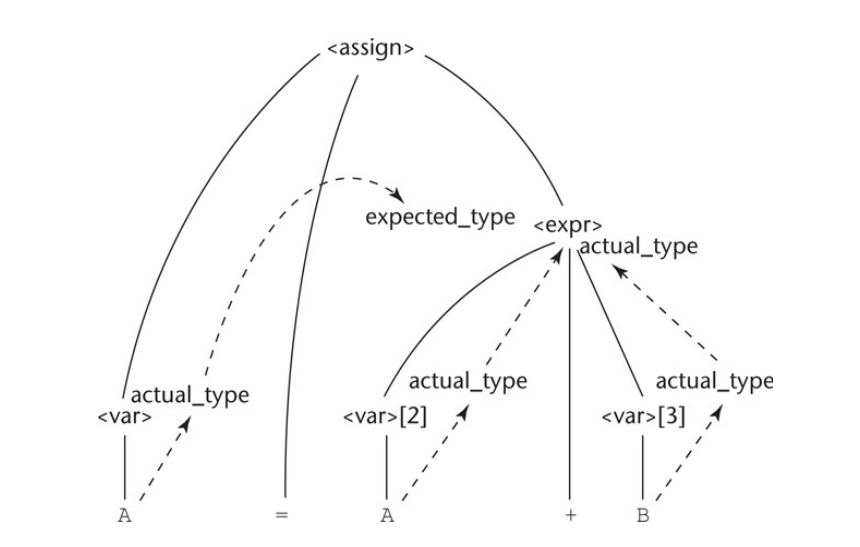
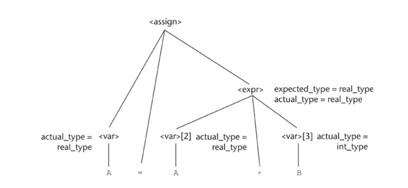

# Attribute Grammars

Context-free grammars (CFGs) allow us to specify the regular expressions that we
use to create words and other strings for our input string of characters and
they allow us to parse our programs, however they aren't always useful in
specifying the meaning of a statement or an expression. 

This is why **attribute grammars** are important; they give us a way to do this
in a notation that complements BNF and they allow us to specify the semantic
requirements of the language that we can use together with BNF.

An **attribute grammar** is an extension to a context-free grammar that's used
to describe features of a programming language that cannot be described in BNF
or can only be described in BNF with great difficulty. Examples:

* Describing the rules that float variables can be assigned integer values but
  the reverse is not true is difficult to describe completely in BNF.

* The rule requiring that all variables must be declared before being used is
  impossible to describe in BNF.

## Static vs Dynamic Semantics

The semantics of language can be **static** or **dynamic**. Which we have
depends on whether the meaning of a program's components changes at runtime.

* The **static semantics** of a language are indirectly related to the meaning of
  programs during execution. They're set when the program is compiled and will
  last through the runtime of a program.

  Its name comes from the fact that these specifications can checked at
  **compile-time**.

* The **dynamic semantics** refer to the meaning of various components of a
  program including expressions, statements, etc. Unlike static semantics, these
  cannot be checked at compile-time and can only be checked at **runtime**.

  In some languages such as Lisp and Schemes it's impossible to check the
  meaning of certain program's components at compile time because they're either
  set at runtime or can be changed then.

## What's an Attribute?

* An **attribute** is a property whose value is assigned to a grammar's symbol.
  It can be the data type of a variable, its value, or its address in memory.

* Attribute grammars make use of two types of function:

  * **Semantic functions** (or attribute computation functions) are associated
    with the productions of a grammar and are used to compute the values of an
    attribute.
  
  * **Predicate functions** state some of the syntax and static semantic rules of
    the grammar.

## Definition of an Attribute Grammar

An attribute grammar is a grammar with the following added features:

* Each symbol $X$ in the grammar has a set of attributes $A(X)$.

* The set $A(X)$ has two **disjoint** sets:
  * $S(X)$ is a set of **synthetized attributes**, which are used to pass
    semantic information up a parse tree from child to parent.
  * $I(X)$ is a set of **inherited attributes**, that also pass semantic
    information but does it down and across a parse tree from parent to child.

* Each production of the grammar has a set of semantic functions and a set of
  predicated functions (which may be an empty set).

* Intrinsic attributes are synthetized attributes whose properties are found
  outside the grammar (e.g., a symbol table which stores variable names and
  their types).

## Examples

### An Attribute Grammar for Assignments

This example illustrates how an attribute grammar can be used to check the type
rules of a simple assignment statement. The syntax and static semantics of
this assignment statement are as follows: 

* The only variable names are $A$, $B$, and $C$.
* The right side of the assignments can be either a variable or an expression in
  the form of a variable added to another variable. 
* The variables can be one of two types: `int` or `real`.
* When there are two variables on the right side of an assignment, they need not
  be the same type.
  * The type of the expression when the operand types are not the same is always
    `real`.
  * When they are the same, the expression type is that of the operands. 
* The type of the left side of the assignment must match the type of the right
  side. So the types of operands in the right side can be mixed, but the
  assignment is valid only if the target and the value resulting from evaluating
  the right side have the same type.
* The attribute grammar specifies these static semantic rules.

The syntax portion of our example attribute grammar is

\begin{grammar}
<assign> $\rightarrow$ <var> = <expr>

<expr>   $\rightarrow$ <var> + <var> | <var>

<var>    $\rightarrow$ A | B | C
\end{grammar}

The attributes for the nonterminals in the example attribute grammar are
described in the following paragraphs:

* `actual_type`. A synthetized attribute associated with the nonterminals
  `<var>` and `<expr>`. It's used to stored the *actual type* (`int` or `real`)
  of a variable or expression.

  * In the case of a variable, the actual type is intrinsic ().
  * In the case of an expression, it's determined from the actual types of the
    child node or children nodes of the `<expr>` nonterminal.

* `expected_type`. An inherited attribute associated with the nonterminal
  `<expr>`. It's used to store the type (either `int` or `real`) that's expected
  for the expression, as determined by the type of the variable on the left side
  of the assignment statement.

The attribute gramma is as follows:

1. Syntax rule: `<assign> -> <var> = <expr>`
     Semantic rule: `<expr>.expected_value <- <var>.actual_type`
2.  Syntax rule: `<expr> -> <var>[2] + <var>[3]`
	([2] and [3] differentiate the three `<var>` nonterminals)

	Semantic rule:

	```
    <expr>.actual_type <-
		  if <var>[2].actual_type == int) and <var>[3].actual_type == int) then
			  int
		  else
			  real
    ```

	**Predicate:** `<expr>.actual_type == <expr>.expected_type`

3.  Syntax rule:  `<expr> -> <var>`

    Semantic rule: `<expr>.actual_type <- <var>.actual_type `

    **Predicate:** `<expr>.actual_type == <expr>.expected_type`

4. Syntax rule:  `<var> -> A | B | C`

   Semantic rule: `<var>.actual_type <- lookup(<var>.string)`

The `look-up` function looks up a given variable name in the symbol table and returns the variable’s type.

**The parse tree for `A = A + B`**

```
                         <assign>
                        /   |    \
                  <var>     =  <expr>
                 .actual_type  .actual_type
                  |            .expected_type
                  A               /    |      \
                            <var>      +    <var>
                            .actual_type    .actual_type
                              |                   |
                              A                   B
```

**How are attribute values computed?**

For `A = B + C`. Initially, there are only intrinsic attributes on the leaves.

  1. `<var>.actual_type <- look-up(A)`     (Rule 4)
  2. `<expr>.expected_type  <- <var>.actual_type` (Rule 1)
  3. `<var>[2].actual_type  <- lookup (A)`   (Rule 4)
     `<var>[3].actual_type  <- lookup (B)`   (Rule 4)
  4. `<var>[1].actual_type <- either int or real` (Rule 2)
  5. `<expr>.expected_type == <expr>.actual_type` is either `TRUE` or `FALSE`

The parse tree down below shows the flow of attribute values. Solid lines show
the parse tree; dashed lines show attribute flow in the tree.



The following parse tree shows the final attribute values on the nodes. In this
example, A is defined as a `real` and B is defined as an `int`.



Determining attribute evaluation order for the general case of an attribute
grammar is a complex problem, requiring the construction of a dependency graph
to show all attribute dependencies.

